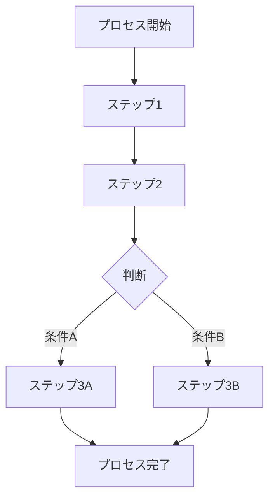
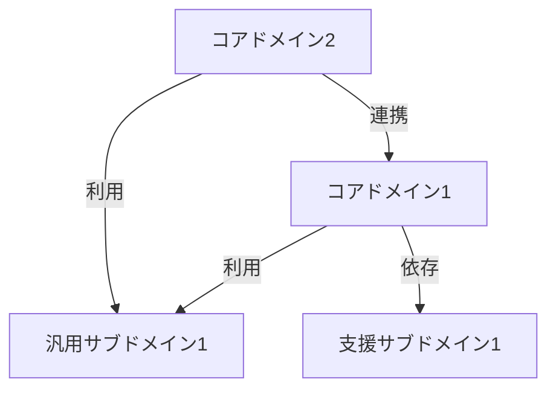

# 要件定義書

## 1. はじめに

### 1.1 目的

[本アプリケーションの目的を簡潔に記述]

### 1.2 対象ユーザー

[主なユーザー層、ペルソナの説明]

### 1.3 プロジェクトの背景

[プロジェクトの背景情報、ビジネス上の必要性]

## 2. 機能要件

### 2.1 コア機能

- **[機能グループ1]**
    
- **[機能グループ2]**
    

### 2.2 ユーザー管理

- [ユーザー登録/認証方法]
- [ユーザープロファイル管理]
- [ロール/権限]

### 2.3 データ管理

- [データ間の関係]

### 2.4 外部連携

### 2.5 通知機能

### 2.6 機能一覧

以下は本アプリケーションで実装する機能の完全なリストです。各機能には優先度、MVPフラグを記録し、開発全体の計画に活用します。

|機能ID|カテゴリ|機能名|説明|優先度(高/中/低)|MVP対象|備考|
|---|---|---|---|---|---|---|
|F001|認証|ユーザー登録|新規ユーザーがメールアドレスとパスワードでアカウント作成できる機能|高|○||
|F002|認証|ログイン|登録済みユーザーがアプリにログインできる機能|高|○||
|F003|認証|ソーシャルログイン|Google/Appleアカウントでのログイン機能|中||Phase2で実装|
|F004|プロフィール|プロフィール表示|ユーザー情報の表示機能|高|○||
|F005|プロフィール|プロフィール編集|ユーザー情報の編集機能|中|||

**優先度の定義:**
- 高: 最重要機能、MVPに必須
- 中: 重要だが初期リリースには必須ではない
- 低: 付加価値機能、余裕があれば実装

**MVP対象:**
- ○: 最小実用製品(MVP)に含める機能
- ×: MVPには含めない機能（将来のイテレーションで実装）

## 3. 非機能要件

### 3.1 パフォーマンス要件

- [レスポンスタイム期待値]
- [並行ユーザー数]
- [データ量想定]

### 3.2 セキュリティ要件

- [認証方式]
- [データ暗号化要件]
- [セキュリティ基準]

### 3.3 ユーザビリティ要件

- [アクセシビリティ基準]
- [対応言語]
- [操作性の要件]

### 3.4 互換性要件

- [対応OS/バージョン]
    - iOS: [バージョン]以上
    - Android: [バージョン]以上
- [対応画面サイズ]

### 3.5 スケーラビリティ要件

- [将来的な拡張性に関する要件]
- [ユーザー増加への対応]

## 4. 制約条件

### 4.1 技術的制約

- [使用技術]
    - フロントエンド: Flutter [バージョン]
    - バックエンド: [技術スタック]
    - データベース: [DB]

### 4.2 ビジネス制約

- [予算制約]
- [納期制約]
- [規制/コンプライアンス要件]

## 5. 仮定と依存関係

### 5.1 仮定

- [前提条件1]
- [前提条件2]

### 5.2 依存関係

- [外部システムへの依存]
- [サードパーティサービスへの依存]

## 6. ドメイン分析（DDD）

### 6.1 ユビキタス言語（共通言語）

以下は本プロジェクトで統一して使用する用語集です。ドメインエキスパートとの対話から抽出され、開発者とビジネス関係者間のコミュニケーションを明確にするために使用します。

| 用語 | 定義 | 技術的対応 |
|-----|------|----------|
| **[用語1]** | [ビジネス上の意味] | [コード上での表現方法] |
| **[用語2]** | [ビジネス上の意味] | [コード上での表現方法] |
| **[用語3]** | [ビジネス上の意味] | [コード上での表現方法] |

### 6.2 ドメイン知識

#### 6.2.1 ビジネスルール

- **[ルール1]**: [説明と背景]
- **[ルール2]**: [説明と背景]

#### 6.2.2 ビジネスプロセス

以下は主要なビジネスプロセスのフローです：

### 6.3 サブドメインの特定

#### 6.3.1 コアドメイン
ビジネスの競争優位性をもたらす中核的な領域：
- **[コアドメイン1]**: [説明と重要性]
- **[コアドメイン2]**: [説明と重要性]

#### 6.3.2 汎用サブドメイン
一般的な機能を提供する領域：
- **[汎用サブドメイン1]**: [説明]
- **[汎用サブドメイン2]**: [説明]

#### 6.3.3 支援サブドメイン
コアドメインをサポートする補助的な領域：
- **[支援サブドメイン1]**: [説明]
- **[支援サブドメイン2]**: [説明]

### 6.4 ドメインの関係性

## 7. 用語集

- **[用語1]**: [説明]
- **[用語2]**: [説明]