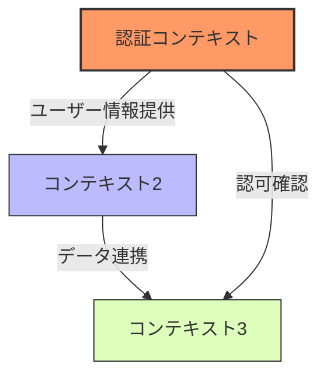
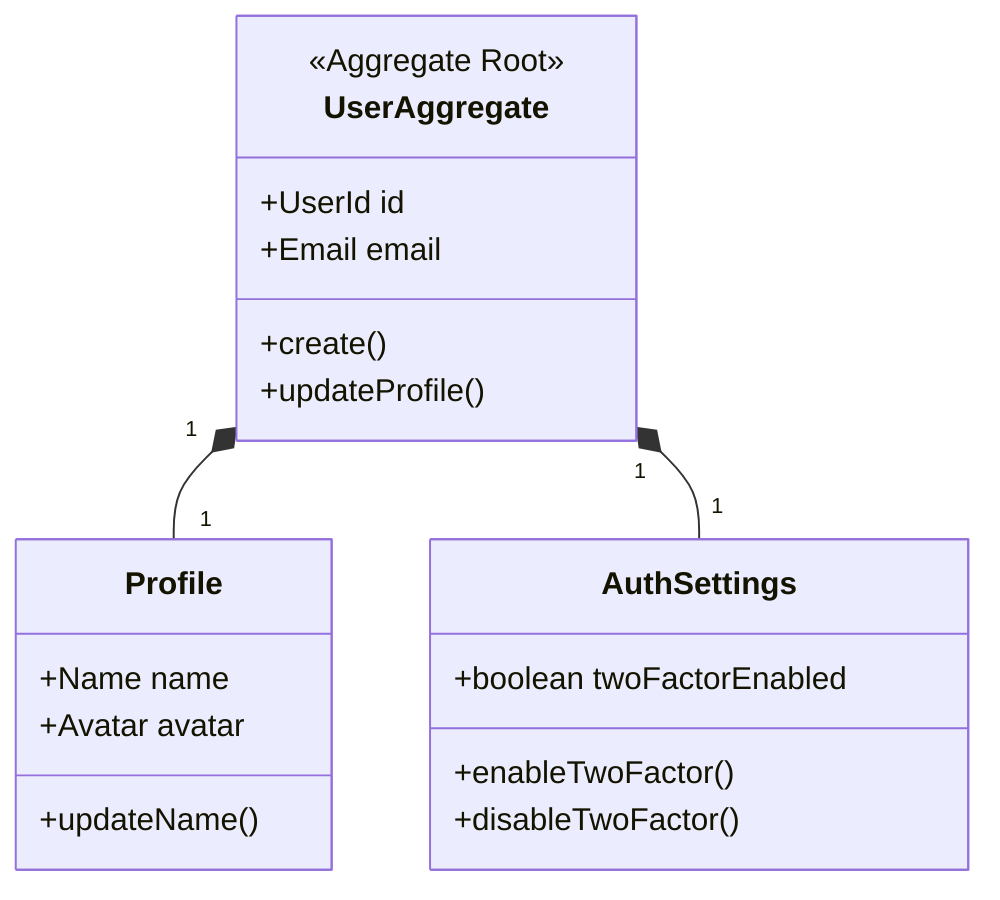
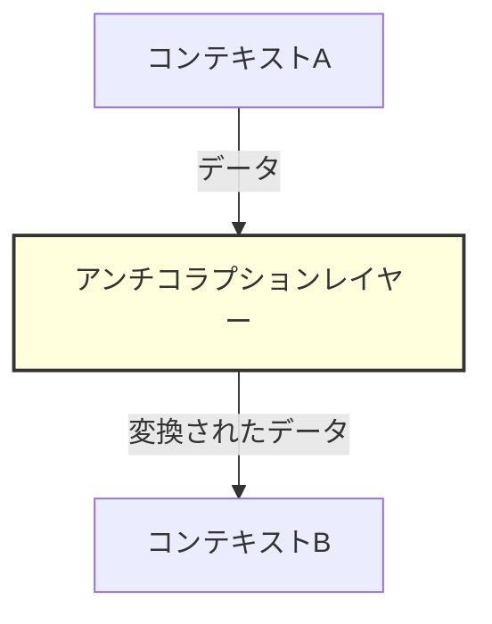

# 基本設計書

## アプリケーション概要

- **アプリ名**: [アプリ名]
- **プラットフォーム**: iOS/Android (Flutter)
- **対象ユーザー**: [ターゲットユーザー]
- **コンセプト**: [アプリのコンセプト]

## ドメイン駆動設計（DDD）

### 境界づけられたコンテキスト（Bounded Context）

アプリケーションの機能を意味のある境界で区切り、各コンテキスト内で一貫したモデルを維持します。

#### コンテキスト一覧

| コンテキスト名 | 説明 | 責任範囲 | 主要エンティティ |
|------------|------|---------|--------------|
| 認証コンテキスト | ユーザー認証と認可に関するドメイン | ログイン、登録、認証状態管理 | User, AuthToken |
| [コンテキスト2] | [説明] | [責任範囲] | [エンティティ] |
| [コンテキスト3] | [説明] | [責任範囲] | [エンティティ] |

#### コンテキストマップ

以下は各境界づけられたコンテキスト間の関係性を表します：



### ドメインモデル概要

#### 主要なドメインオブジェクト

##### エンティティ（ID による識別が重要なオブジェクト）
- **User**: ユーザー情報を表すエンティティ
- **[エンティティ2]**: [説明]

##### 値オブジェクト（属性の値で表現されるオブジェクト）
- **Email**: メールアドレスを表す値オブジェクト
- **Password**: パスワードとその検証ロジックをカプセル化
- **[値オブジェクト3]**: [説明]

##### 集約（Aggregate）とルート
以下の集約は関連するオブジェクトをまとめ、一貫性を維持します：



### 戦略的設計の決定事項

#### コンテキスト間の統合パターン

| コンテキスト間 | 統合パターン | 説明 |
|--------------|------------|------|
| 認証 ↔ [コンテキスト2] | 共有カーネル | 共通のドメインモデル部分を共有 |
| [コンテキスト2] ↔ [コンテキスト3] | カスタマー/サプライヤー | [コンテキスト2]が[コンテキスト3]のサービスを利用 |
| 認証 ↔ [コンテキスト3] | アンチコラプションレイヤー | 変換レイヤーを介して連携 |

#### アンチコラプションレイヤー

以下のコンテキスト間では、外部システムや変更の影響を最小限に抑えるためのアンチコラプションレイヤーを設置します：



- **設置場所**: [コンテキスト名]と[外部システム/他コンテキスト]の間
- **主な役割**: [詳細説明]
- **実装方針**: [アダプター、ファサード等の具体的な実装パターン]

## アーキテクチャ設計

### 全体アーキテクチャ

.cursor/rules/021-directory-structure.mdc を参照する

### 状態管理

- **主要な状態管理手法**: [Riverpod等]
- **選定理由**: [理由]

### データフロー

1. ユーザー操作 → UI Layer
2. UI Layer → Application Layer (UseCase)
3. Application Layer → Domain Layer
4. Domain Layer → Data Layer
5. Data Layer → 外部システム/ローカルDB

## 機能一覧設計

以下は実装予定の機能一覧です。各機能に対する技術的な詳細や設計上の考慮点を記載しています。

|機能ID|機能名|実装レイヤー|関連エンティティ|技術的考慮点|画面ID|
|---|---|---|---|---|---|
|F001|ユーザー登録|UI, Application, Domain, data|User|・パスワードハッシュ化<br>・入力バリデーション<br>・エラーハンドリング|S001|
|F002|ログイン|UI, Application, Domain, data|User, AuthToken|・認証状態の永続化<br>・セッション管理|S002|
|F003|ソーシャルログイン|UI, Application, data|User, SocialAuthProvider|・各プラットフォームの認証連携<br>・APIキー管理|S002|
|F004|プロフィール表示|UI, Application, Domain|User, UserProfile|・画像キャッシュ戦略<br>・遅延読み込み|S003|
|F005|プロフィール編集|UI, Application, Domain, data|User, UserProfile|・画像アップロード処理<br>・フォームの状態管理|S004|

## 画面設計

### 画面一覧

|画面ID|画面名|主な機能|優先度|
|---|---|---|---|
|S001|[画面名1]|[機能]|[高/中/低]|
|S002|[画面名2]|[機能]|[高/中/低]|
|S003|[画面名3]|[機能]|[高/中/低]|

### 画面遷移図

```
[ホーム画面] → [詳細画面]
    ↓          ↑
[設定画面] ← [プロフィール画面]
```

### 主要画面レイアウト

各画面のモックアップまたは主要コンポーネントの説明:

#### 画面1: [画面名]

**主な構成要素**:

- [要素1]
- [要素2]
- [要素3]

**ユーザーフロー**:

1. [ステップ1]
2. [ステップ2]
3. [ステップ3]

## データモデル設計

### ドメイン層のエンティティと値オブジェクト

#### エンティティ

```dart
class User {
  final UserId id;
  final Email email;
  final Profile profile;
  
  User({
    required this.id,
    required this.email,
    required this.profile,
  });
  
  // ドメインロジックを含むメソッド
  bool canAccessFeature(Feature feature) {
    // ビジネスルールに基づいた判定ロジック
    return true;
  }
}
```

#### 値オブジェクト

```dart
class Email {
  final String value;
  
  Email._({required this.value});
  
  // ファクトリコンストラクタでバリデーション
  factory Email.create(String email) {
    if (!_isValid(email)) {
      throw InvalidEmailException('無効なメールアドレス形式です');
    }
    return Email._(value: email);
  }
  
  // ドメインのバリデーションルール
  static bool _isValid(String email) {
    // メールアドレスの検証ロジック
    return RegExp(r'^[^@]+@[^@]+\.[^@]+$').hasMatch(email);
  }
  
  @override
  bool operator ==(Object other) => 
    identical(this, other) || 
    other is Email && value == other.value;
    
  @override
  int get hashCode => value.hashCode;
}
```

### エンティティ関連図

```
[エンティティ1] 1--* [エンティティ2]
      |
      1
      |
      * 
[エンティティ3]
```

## API設計

### 外部API連携 (該当する場合)

|エンドポイント|方法|パラメータ|レスポンス|用途|
|---|---|---|---|---|
|[URL]|GET/POST|[パラメータ]|[レスポンス形式]|[用途]|

### 内部API設計 (バックエンドがある場合)

|エンドポイント|方法|パラメータ|レスポンス|用途|
|---|---|---|---|---|
|[URL]|GET/POST|[パラメータ]|[レスポンス形式]|[用途]|

## セキュリティ設計

### 認証・認可方式

- **認証方式**: [方式] (例: Firebase Authentication, JWT)
- **認可フロー**: [フロー説明]

### データ保護

- **保存データの暗号化**: [方法]
- **通信の暗号化**: HTTPS
- **センシティブ情報の取り扱い**: [方針]

## 性能最適化計画

- **画像最適化**: [方針]
- **オフライン対応**: [方針]
- **メモリ使用量最適化**: [方針]

## 技術的意思決定

|決定事項|選択したオプション|代替案|選択理由|
|---|---|---|---|
|[項目1]|[選択]|[代替案]|[理由]|
|[項目2]|[選択]|[代替案]|[理由]|

## サードパーティライブラリ

|ライブラリ名|バージョン|用途|選定理由|
|---|---|---|---|
|[名前]|[バージョン]|[用途]|[理由]|
|[名前]|[バージョン]|[用途]|[理由]|

## 既知の制限事項

- [制限事項1]
- [制限事項2]

## 将来の拡張性計画

- [拡張計画1]
- [拡張計画2]