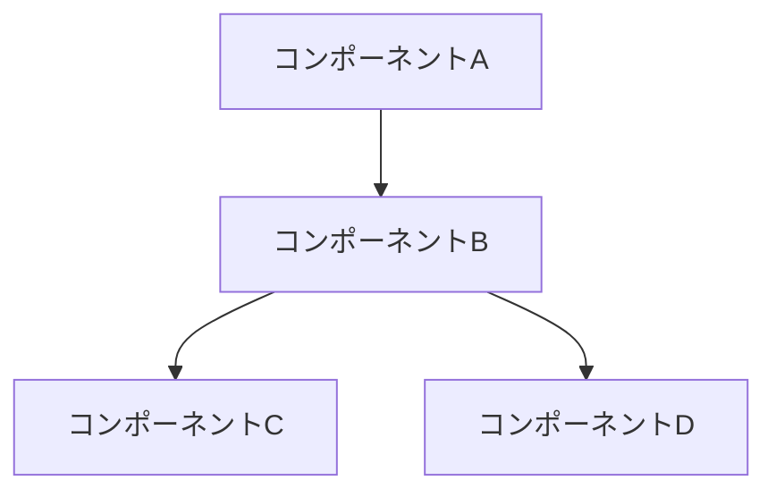
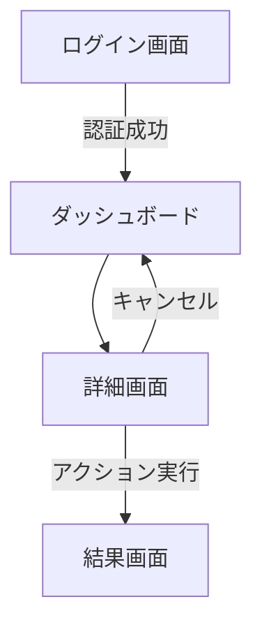

# {{機能名}} 設計ドキュメント

## 概要
<!-- 
この機能の概要を2-3文で簡潔に説明。
ここはドキュメント全体の要約として機能し、読者がこの機能の目的を素早く理解できるようにする。
-->

## 背景と動機
<!-- 
なぜこの機能が必要なのか？
どのような問題を解決するのか？
現状の課題は何か？
-->

## 目標
<!-- 
この機能で達成したいこと。
測定可能な成功指標があれば記載する。
-->

### 目標
* 
* 
* 

### 非目標
<!-- この機能では意図的に対応しないこと -->
* 
* 
* 

## ユーザーストーリー (optional)
<!-- 
この機能がどのようにユーザーの問題を解決するかを説明するストーリー。
「〜として、〜したい。なぜなら〜だからだ。」の形式で記述すると良い。
複数のユーザー種別がある場合は、それぞれについて記述する。
-->

* ユーザーストーリー1
* ユーザーストーリー2

## ドメイン設計（DDD）

### ドメインモデル詳細設計

#### エンティティ
<!-- 
固有のIDを持ち、ライフサイクルを通じて同一性が維持されるオブジェクト。
エンティティには状態変更のメソッドを含め、整合性を保つためのルールを実装する。
-->

```dart
class [EntityName] {
  final [EntityId] id;
  final [ValueObject1] valueObject1;
  [ValueObject2] valueObject2; // 変更可能な値オブジェクト
  
  [EntityName]({
    required this.id,
    required this.valueObject1,
    required this.valueObject2,
  });
  
  // ドメインロジックを表現するメソッド
  Result<void> updateSomething([Parameter] param) {
    // ビジネスルールのチェック
    if (!_someBusinessRule(param)) {
      return Result.failure(DomainError('ビジネスルール違反の理由'));
    }
    
    // 状態変更
    this.valueObject2 = [ValueObject2].create(param);
    return Result.success(null);
  }
  
  // ビジネスルールを表現するプライベートメソッド
  bool _someBusinessRule([Parameter] param) {
    // ドメインの制約チェック
    return true;
  }
}
```

#### 値オブジェクト
<!-- 
属性のみで識別され、同じ属性を持つ値オブジェクトは等価とみなされる。
不変（イミュータブル）であり、自己検証の責任を持つ。
-->

```dart
class [ValueObjectName] {
  final [Type] value;
  
  const [ValueObjectName]._(this.value);
  
  // ファクトリコンストラクタでバリデーション
  static Result<[ValueObjectName]> create([Type] input) {
    // ドメインのバリデーションルール
    if (!_isValid(input)) {
      return Result.failure(DomainError('検証エラーの理由'));
    }
    
    return Result.success([ValueObjectName]._(input));
  }
  
  // ドメインのバリデーションルール
  static bool _isValid([Type] input) {
    // 検証ロジック
    return true;
  }
  
  // 値オブジェクトのビジネス操作
  [ValueObjectName] someOperation() {
    // 新しい値オブジェクトを返す（イミュータブル）
    return [ValueObjectName]._(/* 計算された新しい値 */);
  }
  
  // 等価性の実装
  @override
  bool operator ==(Object other) => 
    identical(this, other) || 
    other is [ValueObjectName] && value == other.value;
    
  @override
  int get hashCode => value.hashCode;
}
```

#### 集約と整合性ルール
<!-- 
一貫性を保つべきエンティティと値オブジェクトのクラスター。
集約ルートを通じてのみアクセスされ、トランザクションの単位となる。
-->

```mermaid
classDiagram
    class [AggregateRoot] {
        <<Aggregate Root>>
        +[RootId] id
        +[ValueObject] valueObject
        +List~[ChildEntity]~ children
        +createChild()
        +removeChild([ChildId])
        +validateConsistency()
    }
    
    class [ChildEntity] {
        +[ChildId] id
        +[ValueObject] valueObject
        +updateValue()
    }
    
    [AggregateRoot] "1" *-- "*" [ChildEntity]
```

**整合性ルール**:
- [ルール1]
- [ルール2]

#### ドメインイベント
<!-- 
ドメイン内の重要な出来事を表すオブジェクト。
副作用の分離や、システム間の疎結合を実現するために使用。
-->

```dart
class [DomainEvent] {
  final DateTime occurredOn;
  final [EntityId] entityId;
  final [AdditionalData] data;
  
  const [DomainEvent]({
    required this.occurredOn,
    required this.entityId,
    required this.data,
  });
}
```

**発行されるドメインイベント**:
- **[イベント1]**: [発生条件と目的]
- **[イベント2]**: [発生条件と目的]

### リポジトリ設計
<!-- 
集約の永続化と再構築を担当するインターフェース。
実装の詳細を隠蔽し、ドメインオブジェクトのコレクションのように振る舞う。
-->

```dart
abstract class [AggregateRoot]Repository {
  // 集約を取得
  Future<Result<[AggregateRoot]>> getById([RootId] id);
  
  // 検索条件による集約の取得
  Future<Result<List<[AggregateRoot]>>> findBy([SearchCriteria] criteria);
  
  // 集約の保存（作成/更新）
  Future<Result<void>> save([AggregateRoot] aggregate);
  
  // 集約の削除
  Future<Result<void>> remove([RootId] id);
}
```

**トランザクション境界**:
- このリポジトリでは、[AggregateRoot]集約全体が単一のトランザクションで保存/読み込みされます
- [複数集約間のトランザクションポリシーがあれば記載]

### ドメインサービス設計
<!-- 
特定のエンティティに自然に属さない操作や、
複数の集約にまたがるドメインロジックを実装するサービス。
-->

```dart
class [DomainService] {
  final [Repository1] repository1;
  final [Repository2] repository2;
  
  [DomainService](this.repository1, this.repository2);
  
  // ドメインの操作
  Future<Result<[Output]>> performOperation([Input] input) async {
    // ドメインロジック（複数のエンティティや集約を操作）
    final aggregate1Result = await repository1.getById(input.id1);
    if (aggregate1Result.isFailure) {
      return Result.failure(aggregate1Result.error);
    }
    
    final aggregate2Result = await repository2.getById(input.id2);
    if (aggregate2Result.isFailure) {
      return Result.failure(aggregate2Result.error);
    }
    
    final aggregate1 = aggregate1Result.value;
    final aggregate2 = aggregate2Result.value;
    
    // ドメインルールの適用
    if (!_someComplexBusinessRule(aggregate1, aggregate2)) {
      return Result.failure(DomainError('ルール違反の理由'));
    }
    
    // 操作の実行
    final result = _executeOperation(aggregate1, aggregate2);
    
    // 変更の永続化
    await repository1.save(aggregate1);
    await repository2.save(aggregate2);
    
    return Result.success(result);
  }
  
  bool _someComplexBusinessRule([AggregateRoot1] a1, [AggregateRoot2] a2) {
    // 複雑なドメインルールのチェック
    return true;
  }
  
  [Output] _executeOperation([AggregateRoot1] a1, [AggregateRoot2] a2) {
    // 操作の実行ロジック
    return [Output]();
  }
}
```

## 詳細設計

### システム構成図
<!-- 
この機能がシステム全体でどのように位置づけられるかを示す図。
コンポーネント間の相互作用を明確に示す。
-->



### API設計
<!-- 
必要なAPIの詳細設計。
エンドポイント、リクエスト/レスポンスの形式、ステータスコード、エラーハンドリングなど。
-->

#### エンドポイント1: `GET /api/resource`

**リクエスト例**:
```
GET /api/resource?param=value
```

**レスポンス例**:
```json
{
  "id": "resource-id",
  "name": "Resource Name",
  "properties": {
    "key": "value"
  }
}
```

**エラーケース**:
* 404: リソースが見つからない場合
* 403: アクセス権限がない場合

### データモデル
<!-- 
この機能で使用/変更するデータモデルの詳細。
テーブル設計、リレーション、重要なフィールドの説明など。
-->

#### モデル1: User

| フィールド | 型 | 説明 | 制約 |
|------------|-----|------|------|
| id | UUID | ユーザーID | 主キー |
| name | String | ユーザー名 | 非NULL |
| email | String | メールアドレス | ユニーク, 非NULL |
| created_at | Timestamp | 作成日時 | 非NULL |

### アルゴリズム
<!-- 
複雑なロジックやアルゴリズムの説明。
擬似コードや流れ図を使って説明するとよい。
-->

```
function processData(input):
  result = []
  for item in input:
    if item.condition == true:
      processed = transform(item)
      result.append(processed)
  return result
```

### UI/UX設計
<!-- 
ユーザーインターフェイスの設計。
ワイヤーフレーム、モックアップ、ユーザーフローなど。
-->

#### 画面1: メイン画面

<!-- ワイヤーフレームや画面設計の説明 -->

#### ユーザーフロー 



## 代替案と検討
<!-- 
検討した代替案とその比較。
選択した設計の根拠を説明する。
-->

### 代替案1
* **概要**: <!-- 代替案の概要 -->
* **利点**: <!-- この代替案の利点 -->
* **欠点**: <!-- この代替案の欠点 -->

### 代替案2 (optional)
* **概要**: <!-- 代替案の概要 -->
* **利点**: <!-- この代替案の利点 -->
* **欠点**: <!-- この代替案の欠点 -->

### 決定と根拠
<!-- 
最終的な決定とその根拠を説明。
重要な設計上の決定ポイントとその理由を明確に記録する。
-->

## パフォーマンスの考慮事項
<!-- 
パフォーマンスに関する考慮事項と対策。
スケーラビリティ、レイテンシ、リソース使用量など。
-->

* 考慮事項1
* 考慮事項2

## セキュリティの考慮事項
<!-- 
セキュリティに関する考慮事項と対策。
認証、認可、データ保護、暗号化など。
-->

* 考慮事項1
* 考慮事項2

## 結合テスト計画
<!-- 
結合テスト、E2Eテストをどのように実施するかの計画。
-->

### 結合テスト
* テストケース1
* テストケース2

## 実装計画
<!-- 
実装の大まかなステップと予想される工数。
マイルストーンや依存関係があれば記載する。
-->

機能実装タスクは、下記の順序で行う。それぞれをプルリクエストの単位とする

T01: feature-design-doc (機能仕様書) の作成
T02: ui層の実装
T03: model層の実装
T04: data層の実装
T05: application層の実装 (必要な場合)
T06: 結合テストの作成・実行

T02 から T05 の 実装は、下記のステップで進る。
それぞれのステップは、コミットの単位とする。

S01: 実装
S02: リファクタリング (lintの修正を含む)
S03: ユニットテストの作成・実行

## application層の要否判断
* [ ] 必要 
* [ ] 不要

**判断の根拠**

---
参考: https://docs.flutter.dev/app-architecture/guide#optional-domain-layer

基準:
アプリが成長し、機能が追加されていくにつれて、state(view_model)に過度に複雑なロジックを追加する場合は、抽象化が必要になる場合があります。
これらのクラスは、アプリケーションまたはユースケースと呼ばれることがよくあります。

アプリケーション層は、UI層とデータ層間のインタラクションをよりシンプルかつ再利用性の高いものにする役割を担います。
リポジトリからデータを取得し、UI層に適した形式に変換します。

アプリケーション層は主に、uiのstate内に存在するビジネス ロジックをカプセル化するために使用され、次の 1 つ以上の条件を満たします。
* 複数のリポジトリからのデータのマージが必要
* 非常に複雑です
* ロジックは異なるstateで再利用されます

## オープンクエスチョンと課題
<!-- 
未解決の問題、懸念事項、今後検討すべき課題。
-->

* 課題1
* 課題2

## 付録 (optional)
<!-- 
参考資料、関連ドキュメントへのリンクなど。
-->

* 関連資料1
* 関連資料2