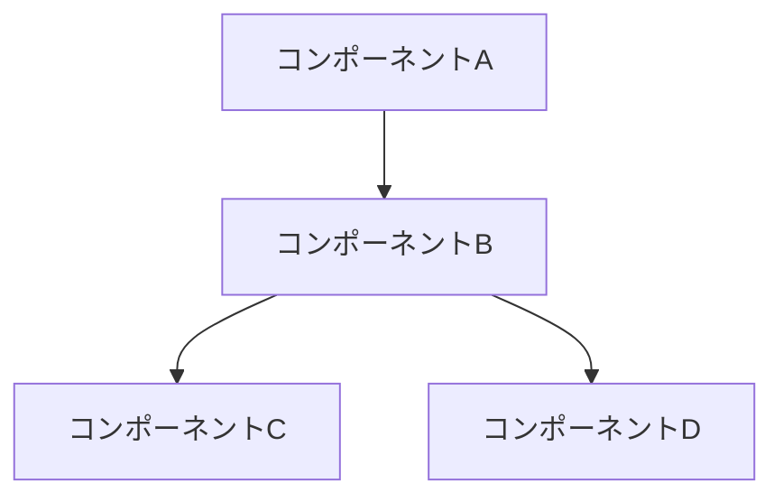
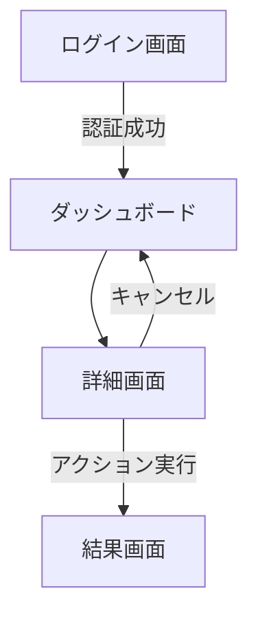

# {{機能名}} 設計ドキュメント

## 概要
<!-- 
この機能の概要を2-3文で簡潔に説明。
ここはドキュメント全体の要約として機能し、読者がこの機能の目的を素早く理解できるようにする。
-->

## 背景と動機
<!-- 
なぜこの機能が必要なのか？
どのような問題を解決するのか？
現状の課題は何か？
-->

## 目標
<!-- 
この機能で達成したいこと。
測定可能な成功指標があれば記載する。
-->

### 目標
* 
* 
* 

### 非目標
<!-- この機能では意図的に対応しないこと -->
* 
* 
* 

## ユーザーストーリー (optional)
<!-- 
この機能がどのようにユーザーの問題を解決するかを説明するストーリー。
「〜として、〜したい。なぜなら〜だからだ。」の形式で記述すると良い。
複数のユーザー種別がある場合は、それぞれについて記述する。
-->

* ユーザーストーリー1
* ユーザーストーリー2

## 詳細設計

### システム構成図
<!-- 
この機能がシステム全体でどのように位置づけられるかを示す図。
コンポーネント間の相互作用を明確に示す。
-->



### API設計
<!-- 
必要なAPIの詳細設計。
エンドポイント、リクエスト/レスポンスの形式、ステータスコード、エラーハンドリングなど。
-->

#### エンドポイント1: `GET /api/resource`

**リクエスト例**:
```
GET /api/resource?param=value
```

**レスポンス例**:
```json
{
  "id": "resource-id",
  "name": "Resource Name",
  "properties": {
    "key": "value"
  }
}
```

**エラーケース**:
* 404: リソースが見つからない場合
* 403: アクセス権限がない場合

### データモデル
<!-- 
この機能で使用/変更するデータモデルの詳細。
テーブル設計、リレーション、重要なフィールドの説明など。
-->

#### モデル1: User

| フィールド | 型 | 説明 | 制約 |
|------------|-----|------|------|
| id | UUID | ユーザーID | 主キー |
| name | String | ユーザー名 | 非NULL |
| email | String | メールアドレス | ユニーク, 非NULL |
| created_at | Timestamp | 作成日時 | 非NULL |

### アルゴリズム
<!-- 
複雑なロジックやアルゴリズムの説明。
擬似コードや流れ図を使って説明するとよい。
-->

```
function processData(input):
  result = []
  for item in input:
    if item.condition == true:
      processed = transform(item)
      result.append(processed)
  return result
```

### UI/UX設計
<!-- 
ユーザーインターフェイスの設計。
ワイヤーフレーム、モックアップ、ユーザーフローなど。
-->

#### 画面1: メイン画面

<!-- ワイヤーフレームや画面設計の説明 -->

#### ユーザーフロー 



## 代替案と検討
<!-- 
検討した代替案とその比較。
選択した設計の根拠を説明する。
-->

### 代替案1
* **概要**: <!-- 代替案の概要 -->
* **利点**: <!-- この代替案の利点 -->
* **欠点**: <!-- この代替案の欠点 -->

### 代替案2 (optional)
* **概要**: <!-- 代替案の概要 -->
* **利点**: <!-- この代替案の利点 -->
* **欠点**: <!-- この代替案の欠点 -->

### 決定と根拠
<!-- 
最終的な決定とその根拠を説明。
重要な設計上の決定ポイントとその理由を明確に記録する。
-->

## パフォーマンスの考慮事項
<!-- 
パフォーマンスに関する考慮事項と対策。
スケーラビリティ、レイテンシ、リソース使用量など。
-->

* 考慮事項1
* 考慮事項2

## セキュリティの考慮事項
<!-- 
セキュリティに関する考慮事項と対策。
認証、認可、データ保護、暗号化など。
-->

* 考慮事項1
* 考慮事項2

## テスト計画
<!-- 
この機能をどのようにテストするかの計画。
単体テスト、結合テスト、エンドツーエンドテストなど。
-->

### 単体テスト
* テストケース1
* テストケース2

### 結合テスト
* テストケース1
* テストケース2

## 実装計画
<!-- 
実装の大まかなステップと予想される工数。
マイルストーンや依存関係があれば記載する。
-->

1. ステップ1: データモデルの実装
2. ステップ2: APIエンドポイントの実装
3. ステップ3: フロントエンドの実装
4. ステップ4: テストとバグ修正

## 運用計画
<!-- 
デプロイ方法、監視方法、アラート設定など。
運用上の考慮事項を記載する。
-->

* デプロイ計画
* モニタリング計画
* ロールバック計画

## オープンクエスチョンと課題
<!-- 
未解決の問題、懸念事項、今後検討すべき課題。
-->

* 課題1
* 課題2

## 付録 (optional)
<!-- 
参考資料、関連ドキュメントへのリンクなど。
-->

* 関連資料1
* 関連資料2