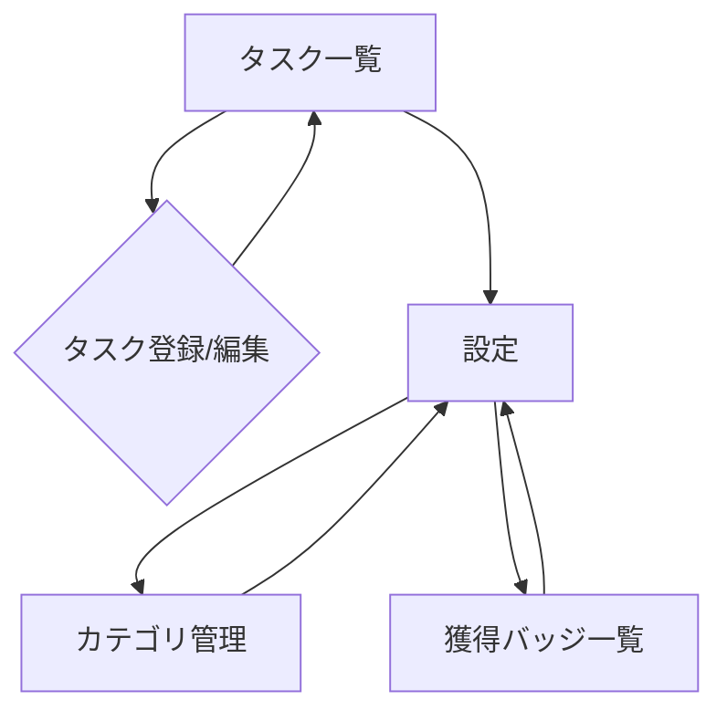
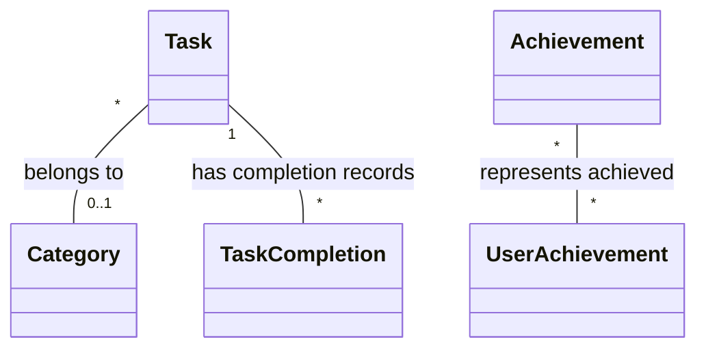

# 基本設計書

## アプリケーション概要

- **アプリ名**: Routine Manager
- **プラットフォーム**: iOS/Android (Flutter)
- **対象ユーザー**: 日々のタスクや習慣を効率的に管理したいと考えている社会人や学生
- **コンセプト**: シンプルで直感的に使える日次・週次タスク管理アプリ。毎日のルーティン継続をサポートする。

## アーキテクチャ設計

### 全体アーキテクチャ

参照: [.cursor/rules/021-directory-structure.mdc](mdc:.cursor/rules/021-directory-structure.mdc)
Flutterのレイヤードアーキテクチャを採用する。
MVP段階ではData Layerは主にローカルストレージへのアクセスを担当する。

- **UI Layer:** 画面表示、ユーザー入力の受付 (Flutter Widgets)
- **Application Layer:** UseCase、状態管理 (Riverpod)
- **Domain Layer:** エンティティ、Value Object、Repositoryインターフェース
- **Data Layer:** Repository実装、ローカルデータソース (Hive/SharedPreferences)

### 状態管理

- **主要な状態管理手法**: Riverpod
- **選定理由**: Flutterコミュニティで広く採用されており、依存性注入(DI)の仕組みも提供しているため。テスト容易性も高い。

### データフロー

1. ユーザー操作 → UI Layer (Widget)
2. UI Layer → Application Layer (Riverpod Provider / Notifier)
3. Application Layer → Domain Layer (UseCase呼び出し、必要に応じて)
4. Application Layer / Domain Layer → Data Layer (Repository呼び出し)
5. Data Layer → ローカルデータソース (Hive/SharedPreferences)

## 機能一覧設計

以下はMVPで実装予定の機能一覧です。各機能に対する技術的な詳細や設計上の考慮点を記載しています。

|機能ID|機能名|実装レイヤー|関連エンティティ|技術的考慮点|画面ID|
|---|---|---|---|---|---|
|F010|タスク登録（毎日）|UI, App, Domain, Data|Task, Category|・繰り返しルールの保存<br>・入力バリデーション|S002|
|F011|タスク登録（週次）|UI, App, Domain, Data|Task, Category|・繰り返し曜日(複数)の保存<br>・入力バリデーション|S002|
|F012|タスク編集|UI, App, Domain, Data|Task, Category|・既存データの読み込み<br>・フォームの状態管理|S002|
|F013|タスク削除|UI, App, Domain, Data|Task|・確認ダイアログ表示<br>・データ永続化|S001, S002|
|F014|タスク一覧表示（リスト）|UI, App, Domain, Data|Task, Category|・今日/今週のタスク判定ロジック<br>・リストのソート順|S001|
|F015|タスク完了切り替え|UI, App, Domain, Data|Task, TaskCompletion|・完了状態の永続化<br>・UIへの即時反映|S001|
|F016|タスク分類設定|UI, App, Domain, Data|Category|・カテゴリ名の重複チェック<br>・カテゴリ削除時の関連タスク処理|S003|
|F020|通知|当日朝リマインダー設定|UI, App, Data|Settings|・時刻設定UI<br>・設定値の永続化|S004|
|F021|通知|当日朝リマインダー通知|App, Data|Task|・ローカル通知のスケジュール設定<br>・アプリプロセス外での実行考慮|N/A|
|F040|アチーブメント判定|App, Domain, Data|TaskCompletion, Achievement, UserAchievement|・達成条件判定ロジック<br>・ユーザー行動のトラッキング|N/A|
|F041|アチーブメント獲得通知|UI, App|UserAchievement|・通知UI（ポップアップ等）<br>・獲得済み判定|S001, S005|
|F042|獲得バッジ一覧表示|UI, App, Domain, Data|Achievement, UserAchievement|・獲得バッジの取得<br>・グリッド表示|S005|

## 画面設計

### 画面一覧

|画面ID|画面名|主な機能|優先度|
|---|---|---|---|
|S001|タスク一覧画面|今日/今週のタスク表示、タスク完了切り替え、タスク追加/編集画面への遷移|高|
|S002|タスク登録/編集画面|タスク名、繰り返し設定、カテゴリ、通知設定の入力・編集|高|
|S003|カテゴリ管理画面|カテゴリの作成・編集・削除|高|
|S004|設定画面|リマインダー時刻の設定、その他設定項目、バッジ一覧への導線|高|
|S005|獲得バッジ一覧画面|獲得したバッジの表示|中|

### 画面遷移図



### 主要画面レイアウト

各画面のモックアップまたは主要コンポーネントの説明:

#### S001: タスク一覧画面

**主な構成要素**:
- AppBar: アプリタイトル、設定画面への遷移アイコン
- 日付表示/切り替え (今日/今週など)
- タスクリスト: 未完了タスクをリスト表示 (タスク名、カテゴリ、チェックボックス)
- 完了済みタスク表示エリア (折りたたみ可能 or 別セクション)
- FAB (Floating Action Button): タスク登録画面への遷移
- ボトムナビゲーション (将来的な拡張用、MVPでは非表示or設定のみも可)

**ユーザーフロー**:
1. アプリ起動時に表示される。
2. リスト内のチェックボックスをタップしてタスクを完了にする。
3. FABをタップしてタスク登録画面へ遷移する。
4. AppBarのアイコンから設定画面へ遷移する。

#### S002: タスク登録/編集画面

**主な構成要素**:
- AppBar: タイトル (登録/編集)、保存ボタン、キャンセル/戻るボタン
- タスク名入力フィールド
- 繰り返し設定選択 (毎日 / 週次[曜日選択])
- カテゴリ選択 (ドロップダウン or 別画面遷移)
- 通知設定 (トグル + 時刻選択 - F020とは別)
- 削除ボタン (編集時のみ表示)

**ユーザーフロー (登録)**:
1. タスク一覧画面のFABから遷移。
2. 必要な情報を入力・選択する。
3. 保存ボタンをタップしてタスクを保存し、タスク一覧画面に戻る。

**ユーザーフロー (編集)**:
1. タスク一覧画面で既存タスクをタップして遷移。
2. 情報を編集する。
3. 保存ボタンをタップして変更を保存し、タスク一覧画面に戻る。
4. 削除ボタンをタップし、確認ダイアログを経てタスクを削除し、タスク一覧画面に戻る。

#### S003: カテゴリ管理画面

**主な構成要素**:
- AppBar: タイトル、追加ボタン
- カテゴリリスト: 既存カテゴリをリスト表示 (編集/削除ボタン付き)
- カテゴリ追加/編集用ダイアログ or 画面

**ユーザーフロー**:
1. タスク一覧画面から遷移 (例: 設定画面経由)。
2. 追加ボタンで新規カテゴリを作成する。
3. リスト内のカテゴリを編集・削除する。

#### S004: 設定画面

**主な構成要素**:
- AppBar: タイトル
- リマインダー設定セクション: 通知ON/OFFスイッチ、通知時刻設定
- カテゴリ管理画面への導線
- アプリ情報 (バージョンなど)

**ユーザーフロー**:
1. タスク一覧画面のAppBarアイコンから遷移。
2. リマインダー設定を変更する。
3. カテゴリ管理画面へ遷移する。

#### S005: 獲得バッジ一覧画面

**主な構成要素**:
- AppBar: タイトル
- バッジグリッド: 獲得したバッジをグリッド形式で表示 (アイコン、バッジ名)
- 未獲得バッジの表示方法 (シルエット表示 or 非表示)

**ユーザーフロー**:
1. 設定画面から遷移。
2. 獲得したバッジの一覧を閲覧する。

## データモデル設計

### エンティティ設計 (Domain Layer)

#### Task (タスク)

```dart
// lib/src/feature/task/domain/entity/task.dart
enum RepeatType { none, daily, weekly }

class Task {
  final String id; // UUID
  final String name;
  final String? categoryId;
  final RepeatType repeatType;
  final Set<int>? repeatWeekdays; // 曜日 (1-7, 月-日), weeklyの場合のみ
  final bool enableNotification;
  // final TimeOfDay? notificationTime; // 通知時刻は設定で一括管理
  final DateTime createdAt;
  final DateTime updatedAt;

  Task({
    required this.id,
    required this.name,
    this.categoryId,
    required this.repeatType,
    this.repeatWeekdays,
    required this.enableNotification,
    required this.createdAt,
    required this.updatedAt,
  });
}
```

#### Category (カテゴリ)

```dart
// lib/src/feature/category/domain/entity/category.dart
class Category {
  final String id; // UUID
  final String name;
  // final String colorCode; // 色分け用に追加しても良い
  final DateTime createdAt;
  final DateTime updatedAt;

  Category({
    required this.id,
    required this.name,
    required this.createdAt,
    required this.updatedAt,
  });
}
```

#### TaskCompletion (タスク完了記録)

日ごとの完了状態を記録するためのモデル。Taskエンティティとは別に管理する。

```dart
// lib/src/feature/task/domain/entity/task_completion.dart
class TaskCompletion {
  final String taskId;
  final DateTime date; // 完了した日付 (YYYY-MM-DD)
  final bool isCompleted;
  final DateTime completedAt;

  TaskCompletion({
    required this.taskId,
    required this.date,
    required this.isCompleted,
    required this.completedAt,
  });
}
```

#### Settings (設定)

```dart
// lib/src/feature/settings/domain/entity/settings.dart
class Settings {
  final bool enableReminder;
  final TimeOfDay reminderTime; // 通知時刻

  Settings({
    required this.enableReminder,
    required this.reminderTime,
  });
}
```

#### Achievement (アチーブメント/バッジ定義)

```dart
// lib/src/feature/achievement/domain/entity/achievement.dart
enum AchievementConditionType { firstTaskComplete, consecutiveTaskComplete, totalTaskComplete, ... }

class Achievement {
  final String id; // 例: 'first_complete', '7_day_streak'
  final String name;
  final String description;
  final String iconAssetPath; // バッジ画像のパス
  final AchievementConditionType conditionType;
  final int conditionValue; // 条件値 (例: 連続日数、合計数)

  Achievement({
    required this.id,
    required this.name,
    required this.description,
    required this.iconAssetPath,
    required this.conditionType,
    required this.conditionValue,
  });
}
```

#### UserAchievement (ユーザー獲得アチーブメント記録)

```dart
// lib/src/feature/achievement/domain/entity/user_achievement.dart
class UserAchievement {
  final String achievementId;
  final DateTime achievedAt;

  UserAchievement({
    required this.achievementId,
    required this.achievedAt,
  });
}
```

### データモデル (Data Layer - ローカル保存用)

- ローカルDB (Hive推奨) に上記エンティティを保存する。
- Hiveの場合は、`@HiveType` アノテーションを付与したアダプタークラスを作成する。
- `TaskCompletion` は `(taskId, date)` を複合キーとして管理する。
- `UserAchievement` は `achievementId` をキーとして管理する。

### エンティティ関連図 (概念)


(Settingsは独立して管理)

## API設計

- MVPでは外部API連携、内部API設計はなし。

## セキュリティ設計

- **認証・認可方式**: MVPではなし。
- **データ保護**: ローカルストレージに保存されるデータについては、OSレベルの保護に依存する。機密性の高い情報（個人情報など）は保存しない。
- **通信の暗号化**: なし (外部通信がないため)。

## 性能最適化計画

- **画像最適化**: [方針]
- **オフライン対応**: [方針]
- **メモリ使用量最適化**: [方針]

## 技術的意思決定

|決定事項|選択したオプション|代替案|選択理由|
|---|---|---|---|
|状態管理|Riverpod|Provider, BLoC/Cubit, GetX|学習コスト、DI機能、テスト容易性のバランスが良いと判断。|
|ローカルDB|Hive|SharedPreferences, SQLite (sqflite)|オブジェクト指向のデータ保存に適しており、パフォーマンスも比較的高いため。SharedPreferencesは単純なキーバリューには良いが、構造化データには不向き。SQLiteは強力だが、セットアップやマイグレーションがやや煩雑。|
|ローカル通知|flutter_local_notifications|awesome_notifications|Flutter公式推奨であり、十分な機能を提供しているため。|
|UUID生成|uuid|nanoid|標準的で広く使われているため。|

## サードパーティライブラリ

|ライブラリ名|バージョン|用途|選定理由|
|---|---|---|---|
|flutter_riverpod|^2.x.x|状態管理、DI|上記参照|
|hive|^2.x.x|ローカルDB|上記参照|
|hive_flutter|^1.x.x|HiveのFlutterインテグレーション|必須|
|path_provider|^2.x.x|ローカルストレージのパス取得|Hiveの初期化に必要|
|flutter_local_notifications|^16.x.x|ローカル通知|上記参照|
|uuid|^4.x.x|一意ID生成|エンティティID生成のため|
|intl|^0.18.x|日付/時刻フォーマット|表示や通知のため|

## 既知の制限事項

- MVP段階では複数デバイス間のデータ同期はできない。
- MVP段階ではユーザーアカウントによるデータ保護はない。
- オフラインでのデータ編集中にアプリが強制終了した場合のデータ整合性については、追加の考慮が必要な場合がある。

## 将来の拡張性計画

- ユーザー認証機能の追加 (Firebase Authenticationなど)
- クラウドDB連携による複数デバイス同期 (Firestoreなど)
- カレンダービューの追加
- **ゲーミフィケーション要素の拡張:**
    - アチーブメント/バッジの種類追加、難易度調整
    - ポイント/経験値システム
    - レベルアップ/ランクシステム
    - キャラクター育成/バーチャルペット
- タスクの並び替え、優先度設定機能
- より詳細な統計・分析機能