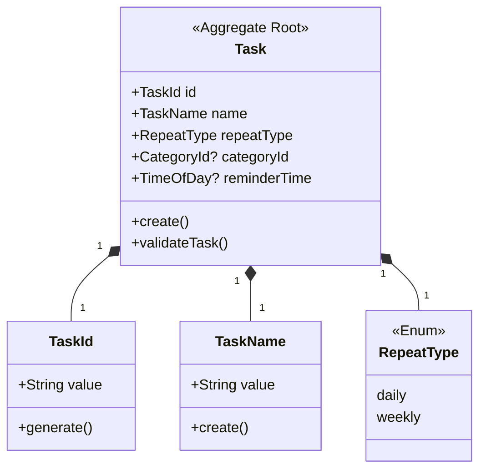
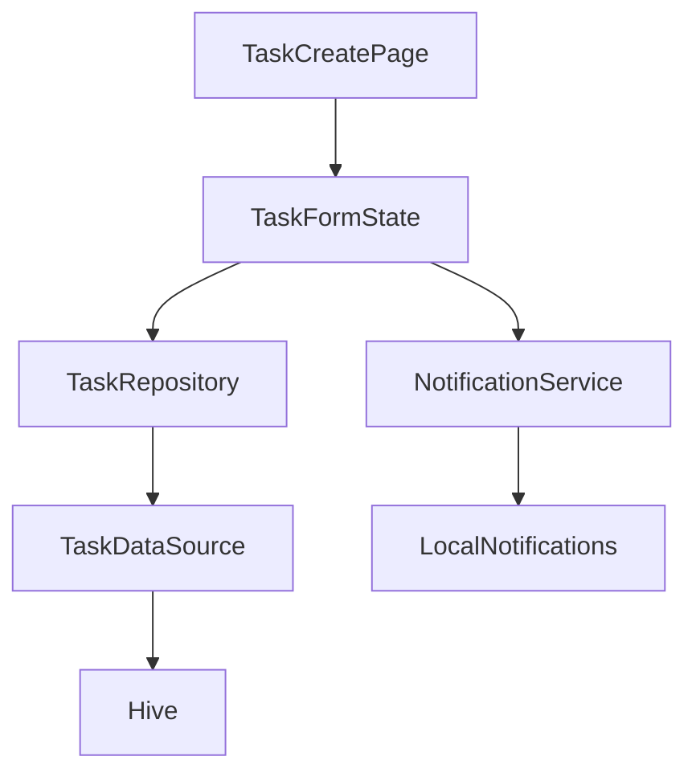
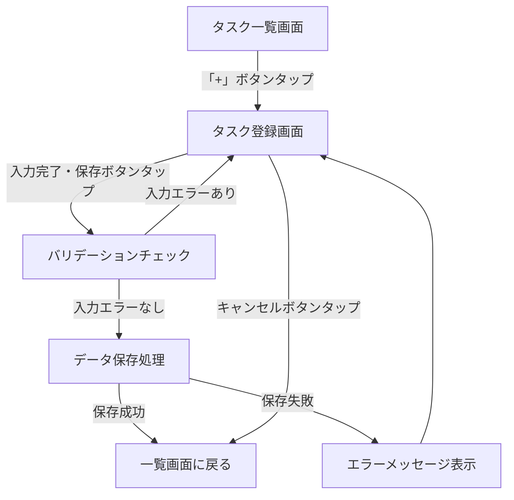

# タスク登録 設計ドキュメント

## 概要
タスク登録機能は、ユーザーが日々のルーティンや習慣として管理したいタスクを新規に作成し、アプリに保存するための機能です。この機能により、ユーザーは繰り返しタスク（日次/週次）の登録や、タスクに関する詳細情報（タイトル、カテゴリ、リマインダー時刻）を設定することができます。

## 背景と動機
日常生活において、繰り返し行うべきタスクや習慣を効率的に管理する必要があります。しかし、既存のタスク管理ツールは多機能で複雑なものが多く、シンプルな繰り返しタスク管理に特化したアプリが求められています。ユーザーが簡単に新しいタスクを登録し、繰り返しの設定ができる機能を提供することで、日常の習慣化をサポートします。

## 目標

### 目標
* ユーザーが直感的に新しいタスクを登録できるUIを提供する
* 日次または週次の繰り返しタスクを登録できるようにする
* タスクにカテゴリやリマインダー時刻を設定できるようにする
* ユーザーの入力に対する適切なバリデーションを実装する
* タスクデータをローカルデータベース（Hive）に安全に保存する

### 非目標
* アプリ初期リリース段階では、複雑な繰り返しパターン（月次、年次、特定の曜日の組み合わせなど）はサポートしない
* クラウド同期機能は現時点では実装しない
* 共有タスクやコラボレーション機能は対象外

## ユーザーストーリー
* ユーザーとして、毎日行うタスクを一度登録しておきたい。そうすることで、毎日入力する手間が省け、習慣化を促進できるから。
* ユーザーとして、週に一度行うタスクを登録しておきたい。そうすることで、定期的なタスクを忘れずに実行できるから。
* ユーザーとして、タスクにカテゴリを設定したい。そうすることで、タスクを目的別に整理でき、管理しやすくなるから。
* ユーザーとして、タスクにリマインダー時刻を設定したい。そうすることで、適切なタイミングで通知を受け取り、タスクの実行を忘れないようにできるから。

## ドメイン設計（DDD）

### ドメインモデル詳細設計

#### エンティティ

```dart
class Task {
  final TaskId id;
  final TaskName name;
  final RepeatType repeatType;
  final CategoryId? categoryId;
  final TimeOfDay? reminderTime;
  
  Task({
    required this.id,
    required this.name,
    required this.repeatType,
    this.categoryId,
    this.reminderTime,
  });
  
  // ビジネスルールのチェック
  static Result<void> validateTask(
    TaskName name,
    RepeatType repeatType,
    CategoryId? categoryId,
    TimeOfDay? reminderTime
  ) {
    // バリデーションロジック
    // 例: 名前の長さ、必須項目のチェックなど
    
    return Result.success(null);
  }
  
  // ファクトリメソッド
  static Result<Task> create(
    TaskName name,
    RepeatType repeatType,
    CategoryId? categoryId,
    TimeOfDay? reminderTime
  ) {
    // ビジネスルールのチェック
    final validationResult = validateTask(name, repeatType, categoryId, reminderTime);
    if (validationResult.isFailure) {
      return Result.failure(validationResult.error);
    }
    
    // 新しいタスクの作成
    return Result.success(Task(
      id: TaskId.generate(),
      name: name,
      repeatType: repeatType,
      categoryId: categoryId,
      reminderTime: reminderTime,
    ));
  }
}
```

#### 値オブジェクト

```dart
// タスクID
class TaskId {
  final String value;
  
  const TaskId._(this.value);
  
  // ファクトリコンストラクタ
  factory TaskId.fromString(String value) {
    return TaskId._(value);
  }
  
  // 新規ID生成
  static TaskId generate() {
    return TaskId._(Uuid().v4());
  }
  
  // 等価性の実装
  @override
  bool operator ==(Object other) => 
    identical(this, other) || 
    other is TaskId && value == other.value;
    
  @override
  int get hashCode => value.hashCode;
}

// タスク名
class TaskName {
  final String value;
  
  const TaskName._(this.value);
  
  // ファクトリコンストラクタでバリデーション
  static Result<TaskName> create(String input) {
    // 空文字チェック
    if (input.trim().isEmpty) {
      return Result.failure(DomainError('タスク名を入力してください'));
    }
    
    // 文字数制限チェック
    if (input.length > 50) {
      return Result.failure(DomainError('タスク名は50文字以内で入力してください'));
    }
    
    return Result.success(TaskName._(input.trim()));
  }
  
  // 等価性の実装
  @override
  bool operator ==(Object other) => 
    identical(this, other) || 
    other is TaskName && value == other.value;
    
  @override
  int get hashCode => value.hashCode;
}

// 繰り返しタイプ
enum RepeatType {
  daily,   // 毎日
  weekly,  // 毎週
}
```

#### 集約と整合性ルール



**整合性ルール**:
- タスク名は必須で、1～50文字の範囲内であること
- 繰り返しタイプは必須で、daily または weekly のいずれかであること
- カテゴリID（任意）が指定された場合、有効なカテゴリIDであること
- リマインダー時刻（任意）が指定された場合、有効な時刻形式であること

#### ドメインイベント

```dart
class TaskCreatedEvent {
  final DateTime occurredOn;
  final TaskId taskId;
  
  const TaskCreatedEvent({
    required this.occurredOn,
    required this.taskId,
  });
}
```

**発行されるドメインイベント**:
- **TaskCreatedEvent**: 新しいタスクが作成された時に発行されます。この後、通知スケジューリングやアチーブメント判定などの処理をトリガーします。

### リポジトリ設計

```dart
abstract class TaskRepository {
  // タスクの取得（ID指定）
  Future<Result<Task>> getById(TaskId id);
  
  // タスクリストの取得（フィルター条件あり）
  Future<Result<List<Task>>> getTasks({
    RepeatType? repeatType,
    CategoryId? categoryId,
  });
  
  // タスクの保存（作成/更新）
  Future<Result<void>> save(Task task);
  
  // タスクの削除
  Future<Result<void>> delete(TaskId id);
}
```

**トランザクション境界**:
- タスク集約は単一のトランザクションで保存/取得されます
- 複数のタスクにまたがる操作（一括削除など）は、現時点ではサポート外です

### ドメインサービス設計

```dart
class TaskDomainService {
  // 現時点では不要
}
```

## 詳細設計

### システム構成図



### API設計
内部API/インターフェースのみのため、外部APIの設計は不要です。

### データモデル

#### TaskDTO

| フィールド | 型 | 説明 | 制約 |
|------------|-----|------|------|
| id | String | タスクID | 主キー |
| name | String | タスク名 | 非NULL |
| repeatType | String | 繰り返しタイプ（"daily"/"weekly"） | 非NULL |
| categoryId | String? | カテゴリID | NULL許容 |
| reminderHour | int? | リマインダー時刻（時） | NULL許容 |
| reminderMinute | int? | リマインダー時刻（分） | NULL許容 |

### アルゴリズム

```
function createTask(input):
  // バリデーション
  taskNameResult = TaskName.create(input.name)
  if taskNameResult.isFailure:
    return Error(taskNameResult.error)
  
  // エンティティ作成
  taskResult = Task.create(
    taskNameResult.value,
    input.repeatType,
    input.categoryId,
    input.reminderTime
  )
  if taskResult.isFailure:
    return Error(taskResult.error)
  
  // 永続化
  saveResult = taskRepository.save(taskResult.value)
  if saveResult.isFailure:
    return Error(saveResult.error)
  
  // 通知設定（リマインダーがある場合）
  if taskResult.value.reminderTime != null:
    notificationService.scheduleTaskReminder(taskResult.value)
  
  // ドメインイベント発行
  eventBus.publish(TaskCreatedEvent(
    occurredOn: DateTime.now(),
    taskId: taskResult.value.id
  ))
  
  return Success(taskResult.value)
```

### UI/UX設計

#### 画面1: タスク登録画面

- ヘッダー: "新しいタスク"
- フォーム項目:
  - タスク名（テキストフィールド、必須）
  - 繰り返しタイプ（ラジオボタン、「毎日」「毎週」の2択、必須）
  - カテゴリ（ドロップダウン、任意）
  - リマインダー時刻（時間ピッカー、任意）
- アクションボタン:
  - 保存（プライマリアクション）
  - キャンセル（セカンダリアクション）

#### ユーザーフロー 



## 代替案と検討

### 代替案1: フォームウィザード方式
* **概要**: 複数ステップのウィザード形式でタスク登録を行う
* **利点**: 各項目をより詳細に説明できる、ユーザーの認知負荷を減らせる
* **欠点**: 単純な入力操作に複数ステップが必要となり、操作が煩雑になる可能性がある

### 代替案2: クイック登録 + 詳細編集の2段階方式
* **概要**: 最初はタスク名のみの簡易登録画面を表示し、詳細設定は別画面で行う
* **利点**: 素早くタスクを登録できる、詳細設定は必要に応じて行える
* **欠点**: 必要な設定を行うのに画面遷移が増える、UIが複雑になる

### 決定と根拠
シンプルな単一フォーム方式を採用します。MVPの目標である「シンプルで直感的なUI/UX」に最も合致しており、少ない項目数であれば一画面でも認知負荷は許容範囲内と判断しました。また、実装の複雑性も低く、早期リリースに適しています。

## パフォーマンスの考慮事項

* タスク数が増えた場合のリスト表示パフォーマンス（ページネーションやレイジーローディングの検討）
* リマインダー時刻設定時の通知スケジューリング処理の最適化

## セキュリティの考慮事項

* ローカルデータの保護（Hiveのエンクリプション検討）
* 将来的なバックエンド連携時の通信暗号化とユーザー認証

## 結合テスト計画

### 結合テスト
* タスク登録画面でのタスク作成フロー全体のテスト
* 入力バリデーションの各パターンテスト
* タスク保存後のリスト表示の確認
* リマインダー設定時の通知スケジューリングテスト

## 実装計画

機能実装タスクは、下記の順序で行う。それぞれをプルリクエストの単位とする

T01: feature-design-doc (機能仕様書) の作成
T02: ui層の実装
T03: domain層の実装 
T04: data層の実装
T05: application層の実装
T06: 結合テストの作成・実行

T02 から T05 の 実装は、下記のステップで進る。
それぞれのステップは、コミットの単位とする。

S01: 実装
S02: リファクタリング (lintの修正を含む)
S03: ユニットテストの作成・実行
S04: プルリクエスト提出とレビュー対応

## application層の要否判断
* [x] 必要 
* [ ] 不要

**判断の根拠**
タスク登録機能では、以下の要素があるため、application層(UseCase)が必要と判断します：
1. UI層とデータ層の間のインタラクションの複雑性（バリデーション、データ変換、通知スケジューリング連携）
2. タスク作成後のドメインイベント発行とそれに伴う副作用の処理
3. 将来的な機能拡張を見据えたビジネスロジックの分離

## オープンクエスチョンと課題

* リマインダー時刻の設定をローカルタイムとUTCどちらで保存すべきか？（将来的なタイムゾーン対応を考慮）
* 同一名称のタスクの重複を許容するか？
* カテゴリが削除された場合、そのカテゴリを参照しているタスクをどう扱うか？

## 付録

* [Flutter Local Notifications ドキュメント](https://pub.dev/packages/flutter_local_notifications)
* [Hive ドキュメント](https://docs.hivedb.dev/)